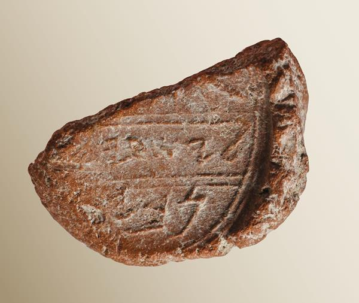

# The Seal Impression of the Prophet Isaiah (2018)

**Posted on December 9, 2024**

Preface: This seemed like a pretty cool thing to do some research about, especially since it was found so recently. This will be my first and only blog post on my website as of now, which is really funny because it makes me seem like I'm a biblical scholar or student, which I am not. I am a computer science student and I will probably write only about computer security. But this funny in an ironic way, and I want the 25 points :)

## Discovery of the Signature

Isaiah is probably the greatest prophet in Israel's history. One might say he is the LeBron James of prophets. Evidence to suggest his existance would have great implications for both Christians and Jewish historians, and that is what brought me to research this topic.

In 2009, Dr. Eilat Mazar and her team made a remarkable discovery at a dig site in Jerusalem. They unearthed a small, but incredibly significant object: a bulla. The bulla was discovered alongside another significant find—the Hezekiah bulla—close to the ancient Solomonic-period Ophel walls in Jerusalem. The presence of both bullae in such proximity raised eyebrows, and soon experts began to realize the profound historical and biblical implications of the discovery.

Dr. Mazar, a prominent archaeologist known for her work in Jerusalem, led the excavation. The Isaiah bulla, a seal impression bearing the name of the Prophet Isaiah, was a small, circular piece of clay with an inscription that read, "Belonging to Isaiah..." The rest of the inscription is partly damaged, but there is a strong consensus that it refers to the Prophet Isaiah, a figure of great significance in the Hebrew Bible. This artifact directly links the biblical Isaiah to the historical reality of 8th-century BCE Judah.

The discovery of the Isaiah bulla was not just an exciting archaeological find—it provided tangible evidence that connects biblical texts with the material world. The seal’s proximity to the Hezekiah bulla also raises intriguing questions about the relationship between the prophet and the king, as they are both prominent figures in the Bible and were closely intertwined in the religious and political events of the time.

The discovery and the fact that it was found next to the Hezekiah bulla not only sheds light on Isaiah’s role in the royal court but also raises questions about the relationship between prophecy and politics in ancient Israel.

## Descriptions of the Bulla
A bulla is essentially an impression left on a lump of clay that was used to seal documents or items in ancient times. The seal impression was typically made by pressing a signet ring or stamp into soft clay to leave a mark, often to verify the authenticity or ownership of an object or document.

The bulla found by Dr. Mazar and her team has an inscription that begins with the phrase, "Belonging to Isaiah..." The rest of the inscription, unfortunately, is damaged, making it difficult to read the entire message. What remains clear, however, is the word "Isaiah," which is central to its importance. Some of the lower portion of the inscription contains three visible letters: "nvy," which may refer to the Hebrew word for "prophet" (nvy').

There has been some debate about the interpretation of the remaining letters. The interpretation hinges on whether "nvy" refers to the title "prophet" or possibly a name or place. Some scholars suggest that "nvy" could be a shortened version of a patronym, meaning “son of Nvy,” or perhaps an ethnicon, indicating a person from a place named "Nvy." However, the most widely accepted interpretation is that "nvy" is the Hebrew word for "prophet" (nvy'), and that the missing letter is likely an aleph, completing the word.

This interpretation is further supported by analysis of the bulla’s border, where the space left by the missing letter appears to fit the letter "aleph." Additionally, the context of the inscription supports the reading of “Isaiah the Prophet” as it aligns with other Hebrew Bible inscriptions and the established role of Isaiah in ancient Judah. The discovery of this bulla is significant not only because it mentions a key biblical figure but also because it represents one of the rare pieces of direct, physical evidence that corroborates the biblical narrative.

A recent discovery from Jerusalem reveals the inconsistent use of the Hebrew definite article "h" in titles and professions on inscribed bullae. The bulla, dating to the end of the First Temple period and found near the Western Wall of the Temple Mount, features two figures with the inscription "lsr‘r" (lesar‘ir), meaning "to the governor of the city," likely referring to Jerusalem. This bulla is significant because it omits the definite article "h" before the word "‘ir" ("city"), even though the article typically appears in the Bible, such as in 2 Chronicles 29:20, where it refers to "governors of the city." This discovery supports the idea that the use of the definite article before titles and professions was not consistent or essential during this period and was instead determined by the scribe's discretion. 

So as all good discoveries go, there are plenty of things left undiscovered and debated.

## Context and Implications

Isaiah is one of the most important figures in the Hebrew Bible. His role as a prophet in the 8th century BCE is well-documented in biblical texts, particularly in the Book of Isaiah. He is credited with prophesying the fall of Israel and the eventual restoration of Judah. His interactions with King Hezekiah are some of the most notable moments in the Bible, and the discovery of the Isaiah bulla adds an element of credibility to these biblical accounts.

In the Bible, Isaiah is portrayed as a divinely inspired prophet who played a crucial role in advising King Hezekiah, especially during the Assyrian invasion of Judah. In one of the most famous episodes, the Assyrian army, under the command of King Sennacherib, laid siege to Jerusalem. Isaiah prophesied that God would protect the city, and, as the Bible recounts, an angel of God struck down 185,000 Assyrian soldiers in one night, forcing the army to retreat. This event is seen as a divine miracle, reinforcing Isaiah’s position as a messenger of God.

Another well-known episode involving Isaiah occurs when King Hezekiah falls seriously ill. The prophet Isaiah tells Hezekiah that he will die, but after Hezekiah prays for healing, Isaiah returns with a message from God, promising Hezekiah an additional 15 years of life. This miraculous healing further strengthens the idea of Isaiah’s prophetic power and his close relationship with the king.

These biblical accounts suggest a deep bond between the prophet and the king, and the discovery of both the Isaiah and Hezekiah bullae within 10 feet of each other adds weight to this narrative. The proximity of the two bullae implies a possible connection between the two men, further supporting the biblical accounts of their interactions.

In addition to these direct interactions, the Bible portrays Isaiah as a key figure in the religious and political life of Judah. His prophecies were not limited to the royal court; they were often directed at the people of Judah, warning them of the consequences of their actions and urging them to repent. His messages were powerful, and he was a vocal critic of the moral decay of his time.

This connection between the bulla and the royal court adds a layer of historical authenticity to the biblical narrative, reinforcing the idea that Isaiah was deeply involved in the affairs of the kingdom of Judah.

One of the most interesting bits I found from an article is "However, the bulla was found just outside what is believed to be the royal Ophel bakery area. Perhaps the sack contained a food item. Even this fits: In 2 Kings 20:7, Isaiah ordered a “cake of figs” to be delivered to a sick Hezekiah."
Maybe he was really into some banger cookies that the royal bakery was handing out. I mean, I'd probably give my seal to some guy if they offered me like a tray of freshly baked cookies. That reminds me of the time that Esau sold his birthright for some soup. I'd want to try that soup too. This pretty much sums up my personal conclusion on this discovery. I want to eat whatever the Ophel bakery was cooking up because if it was so good that Isiah lost his bulla doing it, I can only imagine how good it was. 

## 

**References**: 

[Article 1](https://armstronginstitute.org/704-isaiah-bulla)

[Article 2](https://library.biblicalarchaeology.org/articleis-this-the-prophet-isaiahs-signature/)

[Article 3](https://www.biblicalarchaeology.org/daily/people-cultures-in-the-bible/people-in-the-bible/prophet-isaiah-signature-jerusalem/)

[Video Interview](https://www.youtube.com/watch?v=x_VXkeStQGo)